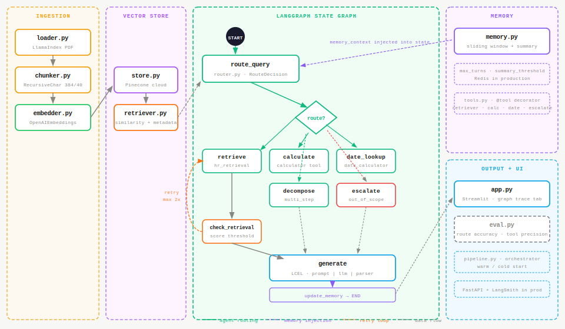
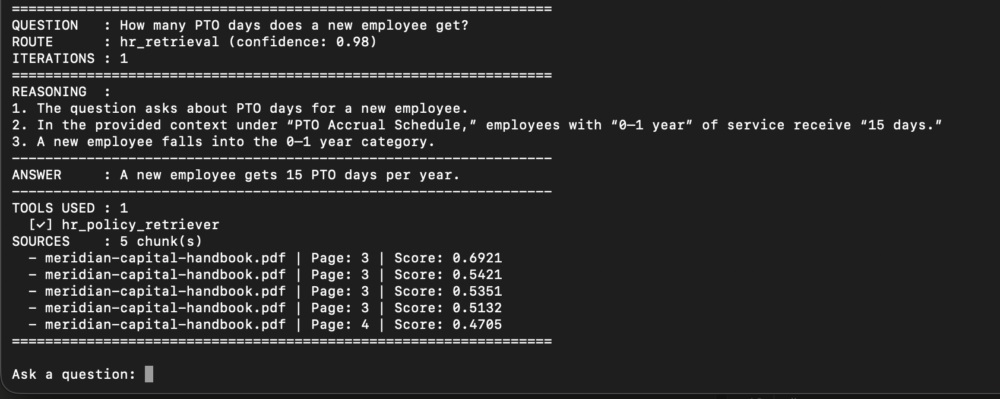
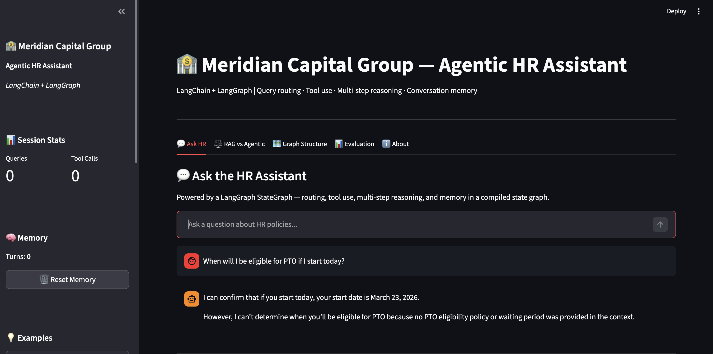
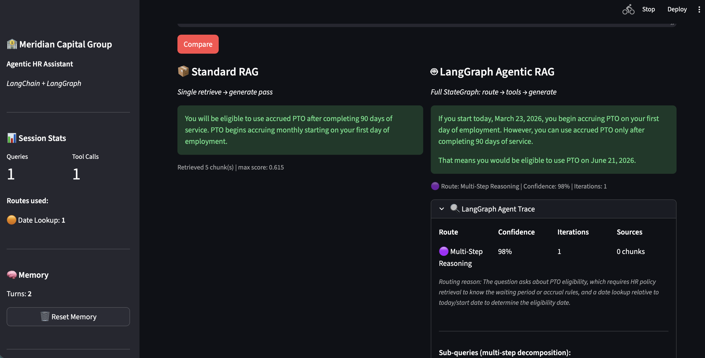

# agentic-rag

An agentic Retrieval-Augmented Generation (RAG) system that extends a baseline RAG pipeline with tool use, query routing, multi-step reasoning, and conversational memory. Built to demonstrate the progression from passive retrieval to an active, decision-making AI agent.

---

## Overview

Where a standard RAG pipeline retrieves context and generates a single response, an agentic RAG system reasons over the query, decides which tools or retrieval paths to use, reflects on intermediate results, and iterates until it reaches a satisfactory answer. This repo showcases that full reasoning loop.



---

## Tech Stack

| Layer | Tool |
|---|---|
| LLM | OpenAI GPT-5.4 (Anthropic Claude via env toggle) |
| Embeddings | OpenAI text-embedding-3-small |
| Vector Store | Pinecone (serverless, cloud managed) |
| Agent Framework | LangChain + LangGraph |
| Memory | Sliding window + summarization (`ConversationMemory`) |
| UI | Streamlit |

---

## Repo Structure

```
agentic-rag/
├── data/
│   ├── raw/
│   └── processed/
├── src/
│   ├── ingestion/
│   │   ├── loader.py
│   │   └── chunker.py
│   ├── embedding/
│   │   └── embedder.py
│   ├── vectorstore/
│   │   └── store.py
│   ├── retrieval/
│   │   └── retriever.py
│   ├── generation/
│   │   └── generator.py
│   ├── agents/
│   │   ├── agent.py
│   │   ├── tools.py
│   │   └── router.py
│   ├── memory/
│   │   └── memory.py
│   └── pipeline.py
├── evaluation/
│   └── eval.py
├── notebooks/
│   └── exploration.ipynb
├── ui/
│   └── app.py
├── tests/
│   └── test_pipeline.py
├── .env.sample
├── requirements.txt
├── Dockerfile
└── README.md
```

---

## Getting Started

**Prerequisites**
- Python 3.10+
- OpenAI or Anthropic API key
- Pinecone API key

**Installation**

Using `venv`:
```bash
git clone https://github.com/tohio/agentic-rag.git
cd agentic-rag
python -m venv .venv
source .venv/bin/activate  # Windows: .venv\Scripts\activate
pip install -r requirements.txt
cp .env.sample .env
# Add your API keys to .env
```

Using `uv`:
```bash
git clone https://github.com/tohio/agentic-rag.git
cd agentic-rag
uv venv
source .venv/bin/activate  # Windows: .venv\Scripts\activate
uv pip install -r requirements.txt
cp .env.sample .env
# Add your API keys to .env
```

**Run the pipeline**

```bash
python src/pipeline.py
```

**Launch the UI**

```bash
streamlit run ui/app.py
```

The UI will be available at `http://localhost:8501` in your browser.

**Run evaluation**

```bash
python evaluation/eval.py --qa data/raw/qa_pairs.json --output evaluation/results.json
```

**Run with Docker**

```bash
docker build -t agentic-rag .
docker run --env-file .env -v $(pwd)/data:/app/data -p 8501:8501 agentic-rag streamlit run ui/app.py
```

The UI will be available at `http://localhost:8501`. Pass your API keys via the `.env` file — do not bake them into the image.

**Run tests**

```bash
pytest tests/test_pipeline.py
```

---

## Screenshots

**CLI — pipeline query with route and source citations**



> Query: *"How many PTO days does a new employee get?"*
> Route: `hr_retrieval` (confidence: 0.98) — retrieved 5 chunks with scores up to 0.69, grounded answer with reasoning trace.

**Streamlit UI — Ask HR tab**



> Clean chat interface with session stats, memory turns, and route tracking in the sidebar. Date-aware answers using the `date_lookup` tool.

**Streamlit UI — RAG vs Agentic comparison tab**



> Same question asked through standard RAG and agentic RAG side by side. Standard RAG returns a generic policy answer. Agentic RAG routes via Multi-Step Reasoning, combines HR policy retrieval with date calculation, and returns a specific eligibility date: **June 21, 2026**. LangGraph agent trace shows route, confidence, iterations, and reasoning.

---

## Key Design Decisions

**LangGraph state graph** — the agent is built as a `StateGraph` with typed `AgentState`, where each node is a pure function and dependencies are injected via `functools.partial` at build time. Conditional edges replace if/else chains, making the routing logic explicit and testable.

**Query routing** — `router.py` uses `with_structured_output()` to force a typed `RouteDecision` object with confidence score and reasoning, directing each query to the right node: HR retrieval, calculator, date lookup, multi-step decomposition, escalation, or out-of-scope handling.

**Agent reasoning loop** — after retrieval, `check_retrieval` evaluates result quality against a score threshold and can re-retrieve up to two times before falling through to generation. The iteration count is bounded by `MAX_AGENT_ITERATIONS` in `.env`.

**Conversational memory** — `ConversationMemory` implements a sliding window with automatic summarization once the turn count exceeds `MEMORY_SUMMARY_THRESHOLD`. Memory context is injected into the initial `AgentState` on every query, not appended to the prompt chain.

**Tool pattern** — tools are registered with the `@tool` decorator and follow a factory pattern in `get_tools()`, returning strings as required by LangGraph's `ToolNode`. Four tools: `hr_policy_retriever`, `calculator`, `date_calculator`, `escalation_router`.

**Streamlit UI** — chosen over Gradio to surface the agent's reasoning steps, route confidence, sub-query decomposition, and tool calls as a structured dashboard alongside the final response.

---

## Evaluation

The `evaluation/` module extends the baseline RAG metrics with agentic-specific measures: route classification accuracy, tool selection precision, average reasoning iterations per query, and escalation rate. Results are aggregated by route type to identify weak spots in the routing logic.

---

## Production Considerations

This project is intentionally scoped for demonstration. In a production system:

- **Vector store** — Pinecone would be configured with namespaces and metadata filtering for multi-tenant support and more precise retrieval.
- **Memory** — `ConversationMemory` would be backed by Redis for persistent, low-latency session storage across multiple users and requests.
- **API layer** — the agent pipeline would be exposed via a FastAPI service with async support to handle the latency of multi-step reasoning without blocking.
- **Frontend** — the Streamlit demo would be replaced by a React or Next.js frontend with streaming support for displaying agent reasoning steps in real time.
- **Observability** — LangSmith would be added for tracing each node execution, tool call, and retrieval result across the full state graph.

---

## Related Project

This repo builds directly on [rag-pipeline](https://github.com/tohio/rag-pipeline), which covers the baseline RAG implementation this system extends.